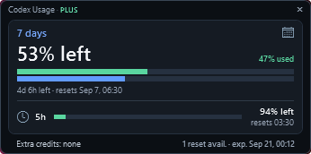

# Codex Usage Viewer

A compact Windows widget that displays your available Codex quota using the
active Codex CLI login.

<p align="center">
  
</p>

The widget is **346 px wide** and automatically adjusts its height to the
available information. The standard single-window layout is approximately
**95 px high**, or approximately **171 px** with both rate-limit windows.
An error message expands the widget without hiding information.

## Launch

Double-click `Start-CodexUsageViewer.vbs`. The launcher starts the widget
without displaying or keeping a PowerShell or Windows Terminal window open.

`Start-CodexUsageViewer.cmd` is also available as an alternative launcher and
forwards startup to the hidden launcher.

The widget displays:

- the used and available percentage for each rate-limit window returned by the account;
- a prominent weekly window with separate usage and time-elapsed bars;
- a compact short window with its usage bar, remaining percentage, and reset time;
- the reset date, time, and countdown;
- the Codex plan, extra credits, and any available free resets, including the
  next reset expiration date and exact time;
- automatic refresh every 60 seconds, with no visible controls.

Drag the compact title area to move the widget. Its position is restored the
next time it starts, including when placed on a second monitor.

## Launch from PowerShell

```powershell
powershell.exe -NoProfile -ExecutionPolicy Bypass -STA -File .\CodexUsageViewer.ps1
```

To change the refresh interval (minimum 15 seconds):

```powershell
.\CodexUsageViewer.ps1 -RefreshSeconds 30
```

## Requirements and privacy

- Windows PowerShell 5.1 or PowerShell 7 on Windows;
- Codex CLI installed, available in `PATH`, and signed in;
- a Codex CLI version that exposes `codex app-server` and `account/rateLimits/read`.

The viewer does not read or store tokens, passwords, or API keys. It starts
`codex app-server` locally, requests a rate-limit snapshot, and immediately
closes the process. The only settings saved in
`%LOCALAPPDATA%\CodexUsageViewer` are the window coordinates.
